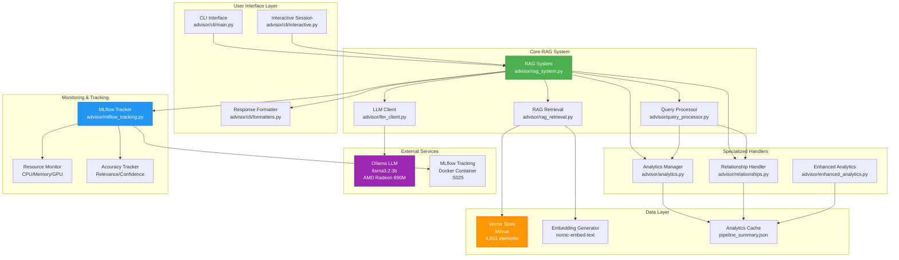
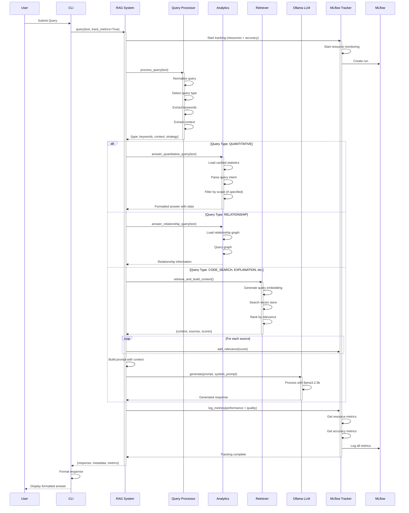
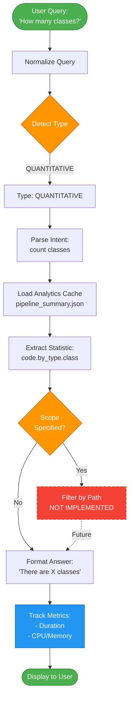

# Egeria Advisor - System Architecture

## Overview

Egeria Advisor is an AI-powered code advisory system that uses Retrieval Augmented Generation (RAG) to answer questions about the egeria-python codebase. The system combines vector search, local LLMs, and comprehensive monitoring to provide accurate, context-aware responses.

---

## System Architecture Diagram



---

## Query Processing Flow



---

## Component Details

### 1. User Interface Layer

#### CLI Interface (`advisor/cli/main.py`)
- **Purpose**: Command-line interface for user interaction
- **Features**:
  - Single query mode
  - Interactive session mode
  - Multiple output formats (text, JSON, markdown)
  - Query history
- **Dependencies**: Click, Rich

#### Interactive Session (`advisor/cli/interactive.py`)
- **Purpose**: Multi-turn conversation interface
- **Features**:
  - Session management
  - Context preservation
  - Command completion
  - History navigation

#### Response Formatter (`advisor/cli/formatters.py`)
- **Purpose**: Format responses for display
- **Features**:
  - Syntax highlighting
  - Table formatting
  - Color-coded output
  - Markdown rendering

### 2. Core RAG System

#### RAG System (`advisor/rag_system.py`)
- **Purpose**: Main orchestrator for query processing
- **Key Methods**:
  - `query()`: Process user queries
  - `chat()`: Multi-turn conversations
  - `explain_code()`: Code explanation
  - `find_similar_code()`: Similarity search
- **Responsibilities**:
  - Route queries to appropriate handlers
  - Coordinate retrieval and generation
  - Manage MLflow tracking
  - Build prompts

#### Query Processor (`advisor/query_processor.py`)
- **Purpose**: Analyze and classify queries
- **Query Types** (9 types):
  1. `CODE_SEARCH`: "How do I...", "Show me..."
  2. `EXPLANATION`: "What is...", "Explain..."
  3. `EXAMPLE`: "Give me an example..."
  4. `COMPARISON`: "What's the difference..."
  5. `BEST_PRACTICE`: "Best way to...", "Recommended..."
  6. `DEBUGGING`: "Why isn't...", "Error..."
  7. `QUANTITATIVE`: "How many...", "Count..."
  8. `RELATIONSHIP`: "What depends on...", "What uses..."
  9. `GENERAL`: Fallback for unclassified queries
- **Features**:
  - Query normalization
  - Keyword extraction
  - Context extraction
  - Search strategy determination

#### RAG Retrieval (`advisor/rag_retrieval.py`)
- **Purpose**: Retrieve relevant code context
- **Features**:
  - Vector similarity search
  - Hybrid search (vector + keyword)
  - Result ranking and filtering
  - Context formatting
- **Search Strategies**:
  - Precise: High threshold, few results
  - Balanced: Medium threshold, moderate results
  - Broad: Low threshold, many results

#### LLM Client (`advisor/llm_client.py`)
- **Purpose**: Interface with Ollama LLM
- **Model**: llama3.2:3b
- **Hardware**: AMD Radeon 890M GPU
- **Features**:
  - Streaming responses
  - Temperature control
  - Token limit management
  - Error handling

### 3. Specialized Handlers

#### Analytics Manager (`advisor/analytics.py`)
- **Purpose**: Answer quantitative queries
- **Data Source**: `pipeline_summary.json` (cached statistics)
- **Capabilities**:
  - Count classes, functions, methods
  - Report file counts and sizes
  - Calculate complexity metrics
  - Provide documentation statistics
- **Limitations**: Currently repo-wide only (no path filtering)

#### Relationship Handler (`advisor/relationships.py`)
- **Purpose**: Answer relationship queries
- **Data Source**: `relationships.json` (dependency graph)
- **Capabilities**:
  - Find dependencies
  - Identify dependents
  - Trace import chains
  - Analyze module relationships

#### Enhanced Analytics (`advisor/enhanced_analytics.py`)
- **Purpose**: Advanced metrics and analysis
- **Features**:
  - Cyclomatic complexity
  - Maintainability index
  - Halstead metrics
  - Code quality scores

### 4. Data Layer

#### Vector Store (Milvus)
- **Purpose**: Store and search code embeddings
- **Size**: 4,601 code elements
- **Schema**:
  - `id`: Unique identifier
  - `embedding`: 768-dimensional vector
  - `content`: Code snippet
  - `metadata`: File path, type, etc.
- **Index**: HNSW for fast similarity search

#### Embedding Generator
- **Model**: nomic-embed-text
- **Dimensions**: 768
- **Purpose**: Convert text to vectors
- **Features**:
  - Batch processing
  - Caching
  - Normalization

#### Analytics Cache
- **File**: `pipeline_summary.json`
- **Contents**:
  - Code statistics (classes, functions, methods)
  - File metadata (counts, sizes, types)
  - Documentation metrics
  - Example counts
- **Update**: Regenerated when codebase changes

### 5. External Services

#### Ollama LLM
- **Model**: llama3.2:3b
- **Hardware**: AMD Radeon 890M GPU
- **Endpoint**: http://localhost:11434
- **Features**:
  - Local inference (no API costs)
  - Fast response times
  - Privacy-preserving

#### MLflow Tracking
- **Deployment**: Docker container
- **Endpoint**: http://localhost:5025
- **Purpose**: Experiment tracking and monitoring
- **Storage**:
  - Backend: SQLite (`mlflow.db`)
  - Artifacts: Local filesystem (`./mlruns`)

### 6. Monitoring & Tracking

#### MLflow Tracker (`advisor/mlflow_tracking.py`)
- **Purpose**: Track experiments and metrics
- **Features**:
  - Run management
  - Parameter logging
  - Metric logging
  - Artifact storage
- **Components**:
  - `MLflowTracker`: Main tracking class
  - `ResourceMonitor`: System resource tracking
  - `AccuracyTracker`: Quality metrics tracking

#### Resource Monitor
- **Metrics Tracked**:
  - `resource_cpu_percent`: CPU usage
  - `resource_memory_mb`: Memory consumption
  - `resource_memory_delta_mb`: Memory change
  - `resource_duration_seconds`: Operation time
- **Technology**: psutil library

#### Accuracy Tracker
- **Metrics Tracked**:
  - `accuracy_relevance_avg`: Vector search quality
  - `accuracy_confidence_avg`: LLM confidence
  - `accuracy_feedback_avg`: User ratings
  - Counts for each metric type
- **Purpose**: Measure and improve response quality

---

## Data Flow Diagrams

### Code Search Query Flow

```mermaid
flowchart TD
    Start([User Query:<br/>'How do I create a glossary?'])
    
    Normalize[Normalize Query<br/>lowercase, trim]
    DetectType{Detect Type}
    
    CodeSearch[Type: CODE_SEARCH]
    ExtractKeywords[Extract Keywords:<br/>create, glossary]
    
    GenerateEmbed[Generate Query<br/>Embedding]
    VectorSearch[Search Vector Store<br/>Top 5 results]
    RankResults[Rank by Relevance<br/>Score > 0.7]
    
    BuildContext[Build Context<br/>from Sources]
    BuildPrompt[Build Prompt with<br/>Context + Instructions]
    
    LLMGenerate[LLM Generate<br/>Response]
    
    TrackMetrics[Track Metrics:<br/>- Relevance scores<br/>- CPU/Memory<br/>- Duration]
    
    FormatResponse[Format Response<br/>with Sources]
    End([Display to User])
    
    Start --> Normalize
    Normalize --> DetectType
    DetectType -->|CODE_SEARCH| CodeSearch
    CodeSearch --> ExtractKeywords
    ExtractKeywords --> GenerateEmbed
    GenerateEmbed --> VectorSearch
    VectorSearch --> RankResults
    RankResults --> BuildContext
    BuildContext --> BuildPrompt
    BuildPrompt --> LLMGenerate
    LLMGenerate --> TrackMetrics
    TrackMetrics --> FormatResponse
    FormatResponse --> End
    
    style Start fill:#4CAF50,stroke:#2E7D32,color:#fff
    style End fill:#4CAF50,stroke:#2E7D32,color:#fff
    style DetectType fill:#FF9800,stroke:#E65100,color:#fff
    style LLMGenerate fill:#9C27B0,stroke:#6A1B9A,color:#fff
    style TrackMetrics fill:#2196F3,stroke:#1565C0,color:#fff
```



### Quantitative Query Flow



---

## Technology Stack

### Core Technologies
- **Language**: Python 3.10+
- **Framework**: Custom RAG implementation
- **LLM**: Ollama (llama3.2:3b)
- **Vector DB**: Milvus
- **Embeddings**: nomic-embed-text (768-dim)
- **Monitoring**: MLflow

### Key Libraries
- **CLI**: Click, Rich
- **LLM**: ollama-python
- **Vector Search**: pymilvus
- **Embeddings**: sentence-transformers
- **Monitoring**: mlflow, psutil
- **Logging**: loguru
- **Testing**: pytest
- **Code Analysis**: ast, radon, pygount

### Infrastructure
- **LLM Server**: Ollama (local)
- **Vector Store**: Milvus (local)
- **Tracking**: MLflow (Docker)
- **GPU**: AMD Radeon 890M

---

## Performance Characteristics

### Query Latency
- **Code Search**: 1-3 seconds
  - Vector search: 100-300ms
  - LLM generation: 800-2500ms
- **Quantitative**: < 100ms (cached data)
- **Relationship**: < 200ms (cached graph)

### Resource Usage
- **Memory**: 200-500 MB per query
- **CPU**: 20-50% during processing
- **GPU**: Used for LLM inference

### Scalability
- **Vector Store**: 4,601 elements (can scale to millions)
- **Concurrent Queries**: Limited by LLM (single GPU)
- **Cache Size**: ~10 MB (statistics + relationships)

---

## Configuration

### Environment Variables
```bash
# LLM Configuration
OLLAMA_BASE_URL=http://localhost:11434
OLLAMA_MODEL=llama3.2:3b

# Vector Store
MILVUS_HOST=localhost
MILVUS_PORT=19530
MILVUS_COLLECTION=egeria_code

# MLflow
MLFLOW_TRACKING_URI=http://localhost:5025
MLFLOW_EXPERIMENT_NAME=egeria-advisor
MLFLOW_ENABLE_TRACKING=true

# Embeddings
EMBEDDING_MODEL=nomic-embed-text
EMBEDDING_DIMENSION=768
```

### Configuration Files
- `config/advisor.yaml`: Main configuration
- `.env`: Environment-specific settings
- `pyproject.toml`: Project metadata and dependencies

---

## Security Considerations

### Data Privacy
- ✅ All processing is local (no external API calls)
- ✅ No data leaves your machine
- ✅ Code never sent to external services

### Access Control
- ⚠️ No authentication (local use only)
- ⚠️ MLflow UI accessible without auth
- ⚠️ Milvus accessible without auth

### Recommendations
- Use firewall to block external access
- Run in isolated network
- Implement authentication for production

---

## Monitoring & Observability

### Metrics Tracked
1. **Performance**:
   - Query latency (p50, p95, p99)
   - Resource consumption (CPU, memory, GPU)
   - Component timing (retrieval, generation)

2. **Quality**:
   - Relevance scores (vector search)
   - Confidence scores (LLM)
   - User feedback ratings

3. **Usage**:
   - Query types distribution
   - Query patterns
   - Error rates

### Dashboards
- **MLflow UI**: http://localhost:5025
  - Experiment tracking
  - Metric visualization
  - Run comparison
  - Artifact storage

---

## Future Enhancements

### Planned Features
1. **Scope Filtering** (High Priority)
   - Filter analytics by path/module
   - Support "classes in pyegeria folder" queries

2. **Query Improvements** (Medium Priority)
   - Increase detection accuracy to 90%+
   - Add confidence scores
   - Context-aware detection

3. **Advanced Analytics** (Medium Priority)
   - Code quality trends
   - Complexity analysis
   - Technical debt metrics

4. **User Feedback** (Low Priority)
   - Rating system
   - Feedback collection
   - Continuous improvement

### Technical Debt
- Query type detection: 66% accuracy (target: 90%+)
- Context extraction: Missing module/operation parsing
- Scope filtering: Not implemented
- Integration tests: Incomplete

---

## Troubleshooting

### Common Issues

#### 1. Metrics Not Showing in MLflow
**Symptoms**: Empty metrics in MLflow UI
**Causes**:
- MLflow not running
- Tracking not enabled
- Wrong experiment name
**Solutions**:
- Check MLflow: `curl http://localhost:5025/health`
- Verify tracking enabled in code
- Check experiment name matches

#### 2. Slow Query Performance
**Symptoms**: Queries take > 5 seconds
**Causes**:
- LLM overloaded
- Vector search slow
- Large context
**Solutions**:
- Reduce top_k results
- Optimize vector index
- Use smaller context

#### 3. Inconsistent Results
**Symptoms**: Same query gives different answers
**Causes**:
- LLM temperature too high
- Query type misdetection
- Vector search randomness
**Solutions**:
- Lower temperature (0.1-0.3)
- Fix query detection
- Set random seed

---

## References

### Documentation
- [MLFLOW_ENHANCED_TRACKING.md](MLFLOW_ENHANCED_TRACKING.md) - MLflow tracking guide
- [PHASE8_TESTING_PLAN.md](PHASE8_TESTING_PLAN.md) - Testing strategy
- [QUALITY_IMPROVEMENT_GUIDE.md](QUALITY_IMPROVEMENT_GUIDE.md) - Quality improvement process
- [RAG_TUNING_GUIDE.md](RAG_TUNING_GUIDE.md) - RAG optimization tips

### External Resources
- [Ollama Documentation](https://ollama.ai/docs)
- [Milvus Documentation](https://milvus.io/docs)
- [MLflow Documentation](https://mlflow.org/docs/latest/index.html)
- [Sentence Transformers](https://www.sbert.net/)

---

## Glossary

- **RAG**: Retrieval Augmented Generation - combining search with LLM generation
- **Vector Store**: Database for storing and searching embeddings
- **Embedding**: Numerical representation of text (768-dimensional vector)
- **LLM**: Large Language Model (llama3.2:3b)
- **MLflow**: Experiment tracking and model management platform
- **Milvus**: Open-source vector database
- **Ollama**: Local LLM server
- **Query Type**: Classification of user intent (9 types)
- **Relevance Score**: Similarity score from vector search (0-1)
- **Context**: Retrieved code snippets provided to LLM

---

## Version History

- **v1.0** (Phase 1-2): Basic RAG system with vector store
- **v1.1** (Phase 3-5): Query processing and retrieval optimization
- **v1.2** (Phase 6): CLI interface and interactive mode
- **v1.3** (Phase 7.5a-b): Analytics and relationship queries
- **v1.4** (Phase 7.5c): Report specification extraction
- **v1.5** (Phase 8): Testing infrastructure and enhanced MLflow tracking
- **v1.6** (Current): Bug fixes and quality improvements

---

*Last Updated: 2026-02-18*
*Document Version: 1.0*