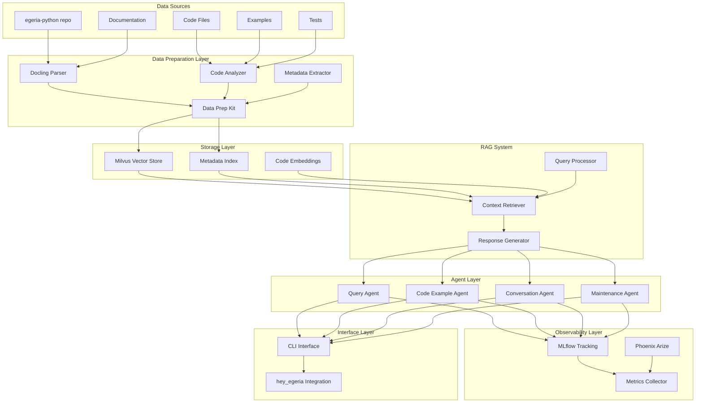

# Egeria Python Advisor - Architecture & Implementation Plan

## Executive Summary

This document outlines the plan for building an agent-based advisor system to help maintain, extend, and use the egeria-python repository. The advisor will leverage RAG (Retrieval Augmented Generation), vector search, and agent frameworks to provide intelligent assistance for queries, code examples, and conversational guidance.

## Project Overview

### Goals
1. Help users write queries and understand Egeria metadata concepts
2. Provide code examples showing how to use pyegeria APIs
3. Assist maintainers with codebase navigation and extension
4. Enable conversational interaction for complex tasks

### Technology Stack
- **Data Preparation**: Docling, Data Prep Kit
- **Vector Store**: Milvus (existing Docker container at localhost:19530)
- **Agent Framework**: BeeAI Framework, AgentStack
- **Experiment Tracking**: MLflow (existing Docker container at localhost:5000)
- **Observability**: Phoenix Arize (for advanced instrumentation if needed)
- **Language**: Python 3.12+
- **Egeria**: Standard quickstart configuration (existing Docker container)
- **Interface**: CLI integration with hey_egeria

### Repository Structure
```
egeria-v6/
├── egeria-python/          # Existing repo (data source)
└── egeria-advisor/         # New separate repository
    ├── advisor/            # Core advisor package
    │   ├── agents/         # Agent implementations
    │   ├── data_prep/      # Data preparation pipeline
    │   ├── rag/            # RAG system components
    │   ├── vector_store/   # Milvus integration
    │   ├── observability/  # MLflow & Phoenix integration
    │   └── cli/            # CLI interface
    ├── config/             # Configuration files
    ├── data/               # Processed data cache
    ├── mlruns/             # MLflow experiment tracking
    ├── tests/              # Test suite
    ├── docs/               # Documentation
    └── examples/           # Usage examples
```

## Architecture Design

### System Architecture



### Component Details

#### 1. Data Preparation Pipeline
- **Input**: egeria-python repository files
- **Processing**:
  - Parse Python code (AST analysis)
  - Extract docstrings, function signatures, class definitions
  - Parse markdown documentation
  - Extract examples from test files
  - Generate embeddings for semantic search
- **Output**: Structured data ready for vector store

#### 2. Vector Store (Milvus)
- **Collections**:
  - `code_snippets`: Function/class implementations
  - `examples`: Usage examples from tests and examples/
  - `documentation`: Parsed markdown and docstrings
  - `api_signatures`: Method signatures and parameters
- **Schema**: Text content, embeddings, metadata (file path, type, category)

#### 3. RAG System
- **Query Processing**: Parse user intent, extract keywords
- **Context Retrieval**: Semantic search in Milvus + keyword filtering
- **Response Generation**: Combine retrieved context with LLM generation

#### 4. Agent Framework
- **Query Agent**: Handles simple queries about Egeria concepts
- **Code Example Agent**: Provides working code examples
- **Conversation Agent**: Multi-turn conversations for complex tasks
- **Maintenance Agent**: Assists with codebase maintenance tasks

## Implementation Phases

### Phase 1: Project Setup & Architecture Design ✓
**Duration**: 1-2 days

**Tasks**:
- [x] Analyze egeria-python repository structure
- [x] Define system architecture
- [x] Create project structure
- [ ] Set up development environment
- [ ] Initialize git repository
- [ ] Create pyproject.toml with dependencies

**Deliverables**:
- Project repository structure
- Architecture documentation (this document)
- Development environment setup guide

**Dependencies**:
```toml
[project]
name = "egeria-advisor"
version = "0.1.0"
requires-python = ">=3.12"

dependencies = [
    "pymilvus>=2.4.0",
    "docling>=1.0.0",
    "data-prep-kit>=0.2.0",
    "bee-agent-framework>=0.1.0",
    "agentstack>=0.1.0",
    "langchain>=0.1.0",
    "openai>=1.0.0",
    "click>=8.0.0",
    "rich>=13.0.0",
    "pydantic>=2.0.0",
    "python-dotenv>=1.0.0",
    "mlflow>=2.10.0",
    "arize-phoenix>=3.0.0",
    "opentelemetry-api>=1.20.0",
    "opentelemetry-sdk>=1.20.0",
]
```

---

### Phase 2: Data Preparation Pipeline
**Duration**: 3-5 days

**Tasks**:
- [ ] Implement code parser using AST
- [ ] Integrate Docling for markdown parsing
- [ ] Set up Data Prep Kit pipeline
- [ ] Create metadata extraction utilities
- [ ] Implement embedding generation
- [ ] Build incremental update mechanism

**Key Components**:

1. **Code Parser** (`advisor/data_prep/code_parser.py`)
   - Parse Python files using AST
   - Extract functions, classes, methods
   - Capture docstrings and type hints
   - Identify patterns (e.g., find methods, OMVS implementations)

2. **Document Parser** (`advisor/data_prep/doc_parser.py`)
   - Use Docling to parse markdown files
   - Extract sections, code blocks, examples
   - Maintain document structure and hierarchy

3. **Example Extractor** (`advisor/data_prep/example_extractor.py`)
   - Parse test files for usage patterns
   - Extract examples from examples/ directory
   - Identify common workflows

4. **Pipeline Orchestrator** (`advisor/data_prep/pipeline.py`)
   - Coordinate parsing and processing
   - Handle incremental updates
   - Generate embeddings
   - Prepare data for Milvus ingestion

**Deliverables**:
- Working data preparation pipeline
- Parsed and structured data from egeria-python
- Embedding generation for all content types

---

### Phase 3: Vector Store Integration
**Duration**: 2-3 days

**Tasks**:
- [ ] Connect to existing Milvus container
- [ ] Design collection schemas
- [ ] Implement data ingestion
- [ ] Create search utilities
- [ ] Build metadata indexing
- [ ] Test retrieval performance

**Milvus Collections Schema**:

```python
# Collection: code_snippets
{
    "id": "auto_id",
    "content": "text",
    "embedding": "vector[768]",
    "file_path": "varchar",
    "type": "varchar",  # function, class, method
    "name": "varchar",
    "module": "varchar",
    "category": "varchar",  # core, omvs, commands, etc.
    "signature": "text",
    "docstring": "text"
}

# Collection: examples
{
    "id": "auto_id",
    "content": "text",
    "embedding": "vector[768]",
    "source_file": "varchar",
    "example_type": "varchar",  # test, example, usage
    "related_apis": "array",
    "description": "text"
}

# Collection: documentation
{
    "id": "auto_id",
    "content": "text",
    "embedding": "vector[768]",
    "file_path": "varchar",
    "section": "varchar",
    "doc_type": "varchar",  # readme, guide, reference
    "keywords": "array"
}
```

**Key Components**:

1. **Milvus Client** (`advisor/vector_store/milvus_client.py`)
   - Connection management
   - Collection operations
   - Search and retrieval

2. **Data Ingestion** (`advisor/vector_store/ingestion.py`)
   - Batch insertion
   - Update handling
   - Error recovery

3. **Search Interface** (`advisor/vector_store/search.py`)
   - Semantic search
   - Hybrid search (vector + keyword)
   - Result ranking and filtering

**Deliverables**:
- Milvus collections created and populated
- Search utilities tested and optimized
- Performance benchmarks

---

### Phase 4: RAG System Implementation
**Duration**: 4-6 days

**Tasks**:
- [ ] Implement query understanding
- [ ] Build context retrieval system
- [ ] Create prompt templates
- [ ] Integrate LLM for generation
- [ ] Implement response formatting
- [ ] Add citation and source tracking

**Key Components**:

1. **Query Processor** (`advisor/rag/query_processor.py`)
   ```python
   class QueryProcessor:
       def parse_intent(self, query: str) -> QueryIntent
       def extract_entities(self, query: str) -> List[Entity]
       def classify_query_type(self, query: str) -> QueryType
   ```

2. **Context Retriever** (`advisor/rag/retriever.py`)
   ```python
   class ContextRetriever:
       def retrieve_relevant_code(self, query: QueryIntent) -> List[CodeSnippet]
       def retrieve_examples(self, query: QueryIntent) -> List[Example]
       def retrieve_documentation(self, query: QueryIntent) -> List[Document]
       def rank_results(self, results: List[Result]) -> List[Result]
   ```

3. **Response Generator** (`advisor/rag/generator.py`)
   ```python
   class ResponseGenerator:
       def generate_response(self, query: str, context: Context) -> Response
       def format_code_example(self, code: CodeSnippet) -> str
       def add_citations(self, response: Response, sources: List[Source]) -> Response
   ```

**Prompt Templates**:
- Query assistance prompts
- Code example generation prompts
- Explanation prompts
- Troubleshooting prompts

**Deliverables**:
- Working RAG system
- Prompt template library
- Response quality evaluation

---

### Phase 5: Agent Framework Setup
**Duration**: 5-7 days

**Tasks**:
- [ ] Set up BeeAI Framework
- [ ] Integrate AgentStack
- [ ] Implement Query Agent
- [ ] Implement Code Example Agent
- [ ] Implement Conversation Agent
- [ ] Create agent orchestration
- [ ] Add memory and context management

**Agent Implementations**:

1. **Query Agent** (`advisor/agents/query_agent.py`)
   - Handles simple factual queries
   - Provides definitions and explanations
   - Returns relevant documentation links
   
   Example queries:
   - "What is a glossary term in Egeria?"
   - "How do I connect to a view server?"
   - "What's the difference between OMVS and OMAS?"

2. **Code Example Agent** (`advisor/agents/code_example_agent.py`)
   - Generates working code examples
   - Shows API usage patterns
   - Provides complete, runnable code
   
   Example queries:
   - "Show me how to create a glossary"
   - "Give me an example of finding assets"
   - "How do I use the collection manager?"

3. **Conversation Agent** (`advisor/agents/conversation_agent.py`)
   - Handles multi-turn conversations
   - Maintains context across interactions
   - Guides users through complex tasks
   
   Example interactions:
   - User: "I want to create a data catalog"
   - Agent: "I can help with that. First, do you have a glossary set up?"
   - User: "No, how do I create one?"
   - Agent: "Here's how to create a glossary..."

4. **Maintenance Agent** (`advisor/agents/maintenance_agent.py`)
   - Assists with code maintenance
   - Helps with refactoring tasks
   - Provides codebase insights
   
   Example queries:
   - "Show me all find methods that need refactoring"
   - "What's the pattern for implementing a new OMVS?"
   - "Find all usages of deprecated methods"

**Agent Orchestration**:
```python
class AdvisorOrchestrator:
    def route_query(self, query: str) -> Agent
    def coordinate_agents(self, task: ComplexTask) -> Response
    def manage_conversation_state(self, session: Session) -> None
```

**Deliverables**:
- Four working agent implementations
- Agent orchestration system
- Conversation state management

---

### Phase 6: CLI Advisor Interface
**Duration**: 3-4 days

**Tasks**:
- [ ] Design CLI interface
- [ ] Integrate with hey_egeria
- [ ] Implement interactive mode
- [ ] Add command shortcuts
- [ ] Create help system
- [ ] Add output formatting

**CLI Design**:

```bash
# New command in hey_egeria
hey_egeria advisor [OPTIONS] [QUERY]

# Interactive mode
hey_egeria advisor --interactive

# Direct query
hey_egeria advisor "How do I create a glossary?"

# With context
hey_egeria advisor --context=glossary "Show me examples"

# Agent selection
hey_egeria advisor --agent=code "Create a collection example"
```

**Key Components**:

1. **CLI Interface** (`advisor/cli/advisor_cli.py`)
   ```python
   @click.group()
   def advisor():
       """Egeria Advisor - AI-powered assistance for pyegeria"""
       pass
   
   @advisor.command()
   @click.argument('query', required=False)
   @click.option('--interactive', '-i', is_flag=True)
   @click.option('--agent', type=click.Choice(['query', 'code', 'conversation']))
   def ask(query, interactive, agent):
       """Ask the advisor a question"""
       pass
   ```

2. **Interactive Session** (`advisor/cli/interactive.py`)
   - REPL-style interface
   - Command history
   - Context preservation
   - Rich formatting

3. **Integration with hey_egeria** (`commands/cli/egeria.py`)
   - Add advisor command group
   - Share configuration
   - Consistent styling

**Deliverables**:
- Working CLI interface
- Integration with hey_egeria
- User documentation

---

### Phase 7: Query Understanding & Response Generation
**Duration**: 4-5 days

**Tasks**:
- [ ] Implement query classification
- [ ] Build intent recognition
- [ ] Create response templates
- [ ] Add code formatting
- [ ] Implement citation system
- [ ] Add confidence scoring

**Query Types**:

1. **Factual Queries**
   - "What is X?"
   - "How does Y work?"
   - "What's the difference between A and B?"

2. **How-to Queries**
   - "How do I create X?"
   - "Show me how to use Y"
   - "What's the best way to Z?"

3. **Troubleshooting Queries**
   - "Why isn't X working?"
   - "I'm getting error Y, what should I do?"
   - "How do I fix Z?"

4. **Exploratory Queries**
   - "What can I do with X?"
   - "Show me examples of Y"
   - "What are the options for Z?"

**Response Components**:

```python
class Response:
    answer: str              # Main answer text
    code_examples: List[str] # Code snippets
    citations: List[Source]  # Source references
    related_topics: List[str] # Related queries
    confidence: float        # Confidence score
    follow_up: List[str]     # Suggested follow-up questions
```

**Deliverables**:
- Query classification system
- Response generation pipeline
- Quality evaluation metrics

---

### Phase 8: Testing & Validation
**Duration**: 3-4 days

**Tasks**:
- [ ] Create test query dataset
- [ ] Implement unit tests
- [ ] Add integration tests
- [ ] Perform end-to-end testing
- [ ] Evaluate response quality
- [ ] Benchmark performance
- [ ] User acceptance testing

**Test Categories**:

1. **Unit Tests**
   - Data preparation components
   - Vector store operations
   - RAG system components
   - Agent implementations

2. **Integration Tests**
   - End-to-end query flow
   - Agent coordination
   - CLI interface
   - Milvus integration

3. **Quality Tests**
   - Response accuracy
   - Code example validity
   - Citation correctness
   - Response relevance

**Test Query Dataset**:
```yaml
queries:
  - query: "How do I create a glossary?"
    expected_type: "how-to"
    expected_agent: "code"
    expected_components: ["code_example", "explanation"]
  
  - query: "What is a collection in Egeria?"
    expected_type: "factual"
    expected_agent: "query"
    expected_components: ["definition", "documentation_link"]
  
  - query: "Show me examples of using the glossary manager"
    expected_type: "exploratory"
    expected_agent: "code"
    expected_components: ["multiple_examples", "usage_patterns"]
```

**Deliverables**:
- Comprehensive test suite
- Quality evaluation report
- Performance benchmarks
- Bug fixes and improvements

---

### Phase 9: Documentation & User Guide
**Duration**: 2-3 days

**Tasks**:
- [ ] Write user guide
- [ ] Create API documentation
- [ ] Add usage examples
- [ ] Write architecture documentation
- [ ] Create troubleshooting guide
- [ ] Add contribution guidelines

**Documentation Structure**:

```
docs/
├── user-guide/
│   ├── getting-started.md
│   ├── basic-queries.md
│   ├── code-examples.md
│   ├── interactive-mode.md
│   └── advanced-usage.md
├── architecture/
│   ├── overview.md
│   ├── data-pipeline.md
│   ├── rag-system.md
│   ├── agents.md
│   └── vector-store.md
├── api/
│   ├── agents.md
│   ├── rag.md
│   └── cli.md
├── examples/
│   ├── query-examples.md
│   ├── code-generation.md
│   └── maintenance-tasks.md
└── contributing/
    ├── setup.md
    ├── adding-agents.md
    └── improving-rag.md
```

**Deliverables**:
- Complete documentation
- Usage examples
- Contribution guide

---

## Incremental Development Strategy

### Iteration 1: Query Assistance (Weeks 1-2)
**Goal**: Basic query answering with documentation retrieval

**Features**:
- Simple factual queries
- Documentation search
- Basic CLI interface

**Success Criteria**:
- Can answer "What is X?" queries
- Returns relevant documentation
- CLI is functional

### Iteration 2: Code Examples (Weeks 3-4)
**Goal**: Generate working code examples

**Features**:
- Code example retrieval
- Example generation
- Code formatting

**Success Criteria**:
- Can provide working code examples
- Examples are relevant and correct
- Code is properly formatted

### Iteration 3: Conversational Interface (Weeks 5-6)
**Goal**: Multi-turn conversations

**Features**:
- Context preservation
- Follow-up questions
- Guided workflows

**Success Criteria**:
- Can handle multi-turn conversations
- Maintains context across turns
- Provides helpful guidance

### Iteration 4: Maintenance Assistance (Weeks 7-8)
**Goal**: Help with codebase maintenance

**Features**:
- Code pattern analysis
- Refactoring assistance
- Codebase insights

**Success Criteria**:
- Can identify patterns
- Provides refactoring suggestions
- Helps navigate codebase

---

## Configuration

### Environment Variables
```bash
# Milvus Configuration
MILVUS_HOST=localhost
MILVUS_PORT=19530
MILVUS_USER=
MILVUS_PASSWORD=

# Egeria Configuration
EGERIA_PLATFORM_URL=https://localhost:9443
EGERIA_VIEW_SERVER=view-server
EGERIA_USER=garygeeke
EGERIA_PASSWORD=secret

# LLM Configuration
OPENAI_API_KEY=your-key-here
LLM_MODEL=gpt-4
LLM_TEMPERATURE=0.7

# Advisor Configuration
ADVISOR_DATA_PATH=/path/to/egeria-python
ADVISOR_CACHE_DIR=./data/cache
ADVISOR_LOG_LEVEL=INFO
```

### Configuration File (`config/advisor.yaml`)
```yaml
data_sources:
  egeria_python_path: /home/dwolfson/localGit/egeria-v6/egeria-python
  include_patterns:
    - "*.py"
    - "*.md"
  exclude_patterns:
    - "**/__pycache__/**"
    - "**/deprecated/**"

vector_store:
  host: localhost
  port: 19530
  collections:
    - code_snippets
    - examples
    - documentation

rag:
  embedding_model: text-embedding-ada-002
  chunk_size: 512
  chunk_overlap: 50
  top_k: 5

agents:
  query_agent:
    enabled: true
    temperature: 0.3
  code_agent:
    enabled: true
    temperature: 0.5
  conversation_agent:
    enabled: true
    temperature: 0.7
  maintenance_agent:
    enabled: true
    temperature: 0.4

cli:
  default_agent: auto
  interactive_mode: true
  output_format: rich
  show_citations: true
```

---

## Success Metrics

### Technical Metrics
- **Response Time**: < 2 seconds for simple queries
- **Accuracy**: > 85% correct answers
- **Code Quality**: 100% of generated code examples are syntactically valid
- **Retrieval Precision**: > 80% relevant results in top 5

### User Experience Metrics
- **User Satisfaction**: > 4/5 rating
- **Task Completion**: > 90% of queries result in useful response
- **Adoption**: Regular usage by team members

### System Metrics
- **Uptime**: > 99%
- **Data Freshness**: < 24 hours lag from repo updates
- **Resource Usage**: < 2GB RAM, < 10% CPU idle

---

## Risk Mitigation

### Technical Risks

1. **Poor Retrieval Quality**
   - **Mitigation**: Extensive testing, tuning of embedding models, hybrid search
   - **Fallback**: Manual curation of high-quality examples

2. **LLM Hallucination**
   - **Mitigation**: Strong citation system, confidence scoring, validation
   - **Fallback**: Return only retrieved content without generation

3. **Performance Issues**
   - **Mitigation**: Caching, batch processing, optimized queries
   - **Fallback**: Async processing, queue system

### Operational Risks

1. **Data Staleness**
   - **Mitigation**: Automated update pipeline, change detection
   - **Fallback**: Manual refresh trigger

2. **Dependency Issues**
   - **Mitigation**: Version pinning, comprehensive testing
   - **Fallback**: Fallback to simpler implementations

---

## Future Enhancements

### Phase 10+: Advanced Features
- **Multi-modal Support**: Handle diagrams, screenshots
- **Code Generation**: Generate new OMVS implementations
- **Automated Testing**: Generate test cases
- **Documentation Generation**: Auto-generate docs from code
- **Integration with IDEs**: VS Code extension
- **Web Interface**: Browser-based UI
- **Collaborative Features**: Share queries and responses
- **Learning System**: Improve from user feedback

---

## Appendix

### A. Technology Evaluation

#### Docling
- **Pros**: Excellent markdown parsing, structure preservation
- **Cons**: May need custom handlers for code blocks
- **Alternative**: markdown-it-py, mistune

#### Data Prep Kit
- **Pros**: Comprehensive preprocessing, extensible
- **Cons**: Learning curve
- **Alternative**: Custom pipeline with pandas

#### BeeAI Framework
- **Pros**: Modern agent framework, good documentation
- **Cons**: Relatively new
- **Alternative**: LangChain, AutoGen

#### AgentStack
- **Pros**: Simplified agent orchestration
- **Cons**: Less mature
- **Alternative**: CrewAI, LangGraph

### B. Sample Queries

**Query Assistance**:
- "What is a glossary term?"
- "How do governance zones work?"
- "What's the difference between OMVS and OMAS?"

**Code Examples**:
- "Show me how to create a glossary"
- "Give me an example of finding assets by name"
- "How do I use the collection manager to create a collection?"

**Conversational**:
- "I want to build a data catalog, where do I start?"
- "Help me understand the relationship between assets and glossaries"
- "Walk me through setting up a new integration"

**Maintenance**:
- "Show me all find methods that need the kwargs refactoring"
- "What's the pattern for implementing a new OMVS module?"
- "Find all deprecated methods in the codebase"

### C. References

- [Egeria Project](https://egeria-project.org)
- [Milvus Documentation](https://milvus.io/docs)
- [Docling](https://github.com/DS4SD/docling)
- [BeeAI Framework](https://github.com/i-am-bee/bee-agent-framework)
- [AgentStack](https://github.com/AgentOps-AI/AgentStack)
- [MLflow](https://mlflow.org/docs/latest/index.html)
- [Phoenix Arize](https://docs.arize.com/phoenix)

---

## Next Steps

1. **Review this plan** with stakeholders
2. **Set up development environment** for egeria-advisor
3. **Begin Phase 1** implementation
4. **Schedule regular check-ins** to track progress
5. **Iterate based on feedback** from early testing

---

**Document Version**: 1.0  
**Last Updated**: 2026-02-13  
**Author**: IBM Bob (Planning Mode)  
**Status**: Ready for Review